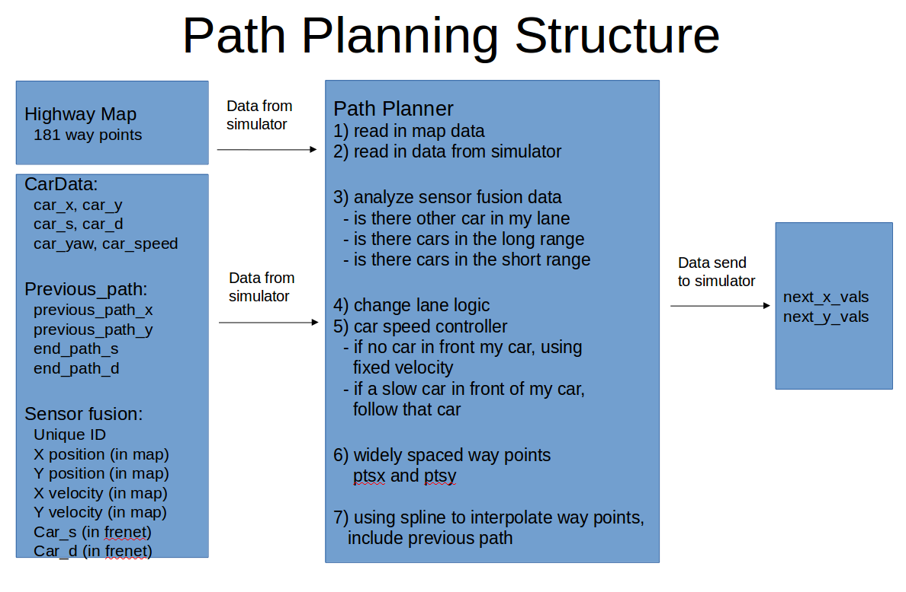

# CarND-Path-Planning-Project
Self-Driving Car Engineer Nanodegree Program

## 1. The goal
The goal of this project is to build a path planner that creates smooth, safe trajectories for the car to follow. The highway track has other vehicles, all going different speeds, but approximately obeying the 50MPH speed limit.

Thej car transimits its location, along with its sensor fusion data, which estimates the location of all the vehicles on the same side of the road.

## 2. My program structure



## 3 Data from CSV file
#### Highway Map
Inside `data/highway_map.csv` there is a list of waypoints that go all the around the track. The track contains a total of 181 waypoints, with the last waypoint mapping back around to the first. The waypoints are in the middle of the double-yellow diving line in the center of the highway.

The track is 6945.554 meters around (about 4.32 miles). If the car averages near 50 MPH, then it should take a little more than 5 minutes for it to go all the way around the highway.

The highway has 6 lanes total - 3 heading in each direction. Each lane is 4 m wide and the car should only ever be in one of the 3 lanes on the right-hand side. The car should always be inside a lane unless doing a lane change.

## 4 Data from simulator

Here is the data provided from the Simulator to the C++ Program

#### Main car's localization Data (No Noise)

["x"] The car's x position in map coordinates
["y"] The car's y position in map coordinates
["s"] The car's s position in frenet coordinates
["d"] The car's d position in frenet coordinates
["yaw"] The car's yaw angle in the map
["speed"] The car's speed in MPH

#### Previous path data given to the Planner

//Note: Return the previous list but with processed points removed, can be a nice tool to show how far along
the path has processed since last time. 
["previous_path_x"] The previous list of x points previously given to the simulator
["previous_path_y"] The previous list of y points previously given to the simulator

#### Previous path's end s and d values 
["end_path_s"] The previous list's last point's frenet s value
["end_path_d"] The previous list's last point's frenet d value

#### Sensor Fusion Data, a list of all other car's attributes on the same side of the road. (No Noise)

["sensor_fusion"] A 2d vector of cars and then that car's [car's unique ID, car's x position in map coordinates, car's y position in map coordinates, car's x velocity in m/s, car's y velocity in m/s, car's s position in frenet coordinates, car's d position in frenet coordinates. 


## 5. Data send to simulator
#### Point Paths
The path planner should output a list of x and y global map coordinates. Each pair of x and y coordinates is a point, and all of the points together form a trajectory. You can use any number of points that you want, but the x list should be the same length as the y list.

Every 20 ms the car moves to the next point on the list. The car's new rotation becomes the line between the previous waypoint and the car's new location.
The car moves from point to point perfectly, so you don't have to worry about building a controller for this project.

## 6. The pipeline

#### 6.1 Using sensor fusion data 
It's important that the car doesn't crash into any of the other vehicles on the road, all of which are moving at different speeds around the speed limit and can change lanes.

The sensor_fusion variable contains all the information about the cars on the right-hand side of the road.

The data format for each car is:[id, x, y, vx, vy, s, d]. The id is a unique identifier for the car. The x,y values are in global map coordinates, and the vx, vy values are the velocity components, also in reference to the global map. Finally s and d are Frenet coordinates for that car.

The vx, vy values can be useful for predicting where the cars will be in the future. For instance, if you were to assume that the tracked car kept moving along the road, then its future predicted Frenet s value will be its current s value plus its (transform) total velocity (m/s) multiplied by the time elapsed into the future (s).

The data format for each car is:[id,x,y,vx,vy,s,d]. The id is a unique identifier for that car 

In my pipeline, I check the car in each lane.
`lane_has_car` means there are cars in the lane, in a large area. These data will be used for select best lane.
`lane_has_car_close` means there ares near to our car, in a small area. These data will be used for decide whether our car could change lane. 

```
// check car distance  
for(int k = 0; k < 3; k++)
{
  if(d < (2+4*k+2) && d > (2+4*k -2))
  {
    // has car far, for analyze best lane
    if((check_car_s - car_s)>-20 && (check_car_s - car_s) < (has_car_distance + 1))
    {
      lane_has_car[k] = true;
    }
    // has car close, for change lane
    if((check_car_s - car_s)>-10 && (check_car_s - car_s) < (has_car_close + 1))
    {
      lane_has_car_close[k] = true;
    }
  }
}
```

#### 6.2 change lane logic
- I build an function `getBestLane` to analyze which lane is the best. 
- Then I define an variable `laneStable` to describe an state that the car is in the middle of the lane, and command lane number is same to the actual lane position.
- Finally, if the `bestlane` is diffrent with `lane`, and other condition is ok, the car could change lane.

```
// change lane logic
// Does the in lane, and the car is stable?
double ds = 0.2;
bool lane0stable = (lane == 0) && (car_d < 2+ds) && (car_d > 2 - ds);
bool lane1stable = (lane == 1) && (car_d < 6+ds) && (car_d > 6 - ds);
bool lane2stable = (lane == 2) && (car_d < 10+ds) && (car_d > 10 - ds);

// which is the best lane ?
int bestLane;
bestLane = getBestLane(lane_has_car[0],lane_has_car[1],lane_has_car[2],lane);
//std::cout << "best lane: " << bestLane << std::endl; 

float lowest_chang_lane_speed = 25;
// change lane when all condition is true
// 0 -> 1
if (lane == 0 && (bestLane == 1 || bestLane == 2) && lane_has_car_close[1] == false 
  && lane0stable && car_speed>lowest_chang_lane_speed ) {
lane = 1;
}
// 1 -> 2
else if (lane == 1 && bestLane == 2 && lane_has_car_close[2] == false && lane1stable 
      && car_speed>lowest_chang_lane_speed ) {
lane = 2;
}
// 2 -> 1
else if (lane == 2 && (bestLane == 0 || bestLane == 1) && lane_has_car_close[1] == false 
      && lane2stable && car_speed>lowest_chang_lane_speed ) {
lane = 1;
}
// 1 -> 0
else if (lane == 1 && bestLane == 0 && lane_has_car_close[0] == false && lane1stable 
      && car_speed>lowest_chang_lane_speed ) {
lane = 0;
}

```

#### 6.3 Velocity control
The velocity of the car depends on the spacing of the points. Because the car moves to a new waypoint every 20ms, the larger the spacing between points, the faster the car will travel. The speed goal is to have the car traveling at (but not above) the 50 MPH speed limit as often as possible. But there will be times when traffic gets in the way.

In my pipeline I use these functions to control the velocity:
- If there is no car infront of my car, the command velocity should be MaxSpeed.
- If there is car infront of my car, my car will follow that car.
- There is a PD controller to control the acceleration / deceleration of the car, to maintain the distance to the car I followed.
- There is also speed change limit and speed limit.


```
// speed control,use a p + d controller to optimize the speed of the car, relate to car distance                 
double delta_s;
double delta_v;
double dv_p;
double dv_d;
double speed_control_kp = 0.015;
double speed_control_td = 1.0;
double speed_limit = 49.5;

delta_s = near_car_s - car_s - follow_distance; // m
if (is_initialize)
{
dv_d = 0;// first cycle
}
else
{
dv_d = speed_control_td * (delta_s - last_delta_s);
}

dv_p = delta_s * speed_control_kp;

delta_v = dv_p + dv_d;
last_delta_s = delta_s;
is_initialize = false;

if (delta_v > 0.5)
{delta_v = 0.5; } 

if (delta_v < - 1.0)
{delta_v = - 1.0; } 

ref_vel += delta_v;

//speed limit
if (ref_vel > speed_limit )
{
ref_vel = speed_limit;
} 
```

#### 6.4 Widely spaced way points 
create a list of widely spaced (x,y) waypoints, evenly spaced at 30m, later we will interpolate these waypoints with a spline and fill it in with more points

Using information from the previous path ensures that there is a smooth transition from cycle to cycle. But the more waypoints we use from the previous path, the less the new path will reflect dynamic changes in the environment.

Ideally, we might only use a few waypoints from the previous path and then generate the rest of the new path based on new data from the car's sensor fusion information.

We have included a helper function, `getXY`, which takes in Frenet (s,d) coordinates and transforms them to (x,y) coordinates.

## Interpolating Points
If you need to estimate the location of points between the known waypoints, you will need to "interpolate" the position of those points. In previous lessons we looked at fitting polynomials to waypoints. Once you have a polynomial function, you can use it to interpolate the location of a new point.

There are also other methods you could use. For example, Bezier curve fitting with control points, or spline fitting, which guarantees that the generated function passes through every point.

I use spline to interpolate the points.

```
// create a spline
tk::spline s;

// set (x,y) points to the spline
s.set_points(ptsx,ptsy);

// Define the actual (x,y) points we will use for the planner
vector<double> next_x_vals;
vector<double> next_y_vals;

//start with all of the previous path points from last time
for(int i=0; i< previous_path_x.size();i++)
{
  next_x_vals.push_back(previous_path_x[i]);
  next_y_vals.push_back(previous_path_y[i]);
}

// calculate how to break up spline points so that we travel at our desired reference velocity
double target_x = 30.0;
double target_y = s(target_x);
double target_dist = sqrt((target_x)*(target_x)+(target_y)*(target_y));

double x_add_on = 0;

// Fill up the rest of our path planner after filling it with previouspoints,
// heare we will alway output 50 points
for (int i = 1; i<= 50-previous_path_x.size();i++)
{
  double N = (target_dist/(.02*ref_vel/2.24));
  double x_point = x_add_on+(target_x)/N;
  double y_point = s(x_point);

  x_add_on = x_point;

  double x_ref = x_point;
  double y_ref = y_point;

  //rotate back to normal after rotating it earlier
  x_point = (x_ref *cos(ref_yaw)-y_ref*sin(ref_yaw));
  y_point = (x_ref *sin(ref_yaw)+y_ref*cos(ref_yaw));

  x_point += ref_x;
  y_point += ref_y;

  next_x_vals.push_back(x_point);
  next_y_vals.push_back(y_point);
}
```

## The original udacity readme

### Simulator.
You can download the Term3 Simulator which contains the Path Planning Project from the [releases tab (https://github.com/udacity/self-driving-car-sim/releases/tag/T3_v1.2).

### Goals
In this project your goal is to safely navigate around a virtual highway with other traffic that is driving +-10 MPH of the 50 MPH speed limit. You will be provided the car's localization and sensor fusion data, there is also a sparse map list of waypoints around the highway. The car should try to go as close as possible to the 50 MPH speed limit, which means passing slower traffic when possible, note that other cars will try to change lanes too. The car should avoid hitting other cars at all cost as well as driving inside of the marked road lanes at all times, unless going from one lane to another. The car should be able to make one complete loop around the 6946m highway. Since the car is trying to go 50 MPH, it should take a little over 5 minutes to complete 1 loop. Also the car should not experience total acceleration over 10 m/s^2 and jerk that is greater than 10 m/s^3.

#### The map of the highway is in data/highway_map.txt
Each waypoint in the list contains  [x,y,s,dx,dy] values. x and y are the waypoint's map coordinate position, the s value is the distance along the road to get to that waypoint in meters, the dx and dy values define the unit normal vector pointing outward of the highway loop.

The highway's waypoints loop around so the frenet s value, distance along the road, goes from 0 to 6945.554.

## Basic Build Instructions

1. Clone this repo.
2. Make a build directory: `mkdir build && cd build`
3. Compile: `cmake .. && make`
4. Run it: `./path_planning`.

Here is the data provided from the Simulator to the C++ Program

#### Main car's localization Data (No Noise)

["x"] The car's x position in map coordinates

["y"] The car's y position in map coordinates

["s"] The car's s position in frenet coordinates

["d"] The car's d position in frenet coordinates

["yaw"] The car's yaw angle in the map

["speed"] The car's speed in MPH

#### Previous path data given to the Planner

//Note: Return the previous list but with processed points removed, can be a nice tool to show how far along
the path has processed since last time. 

["previous_path_x"] The previous list of x points previously given to the simulator

["previous_path_y"] The previous list of y points previously given to the simulator

#### Previous path's end s and d values 

["end_path_s"] The previous list's last point's frenet s value

["end_path_d"] The previous list's last point's frenet d value

#### Sensor Fusion Data, a list of all other car's attributes on the same side of the road. (No Noise)

["sensor_fusion"] A 2d vector of cars and then that car's [car's unique ID, car's x position in map coordinates, car's y position in map coordinates, car's x velocity in m/s, car's y velocity in m/s, car's s position in frenet coordinates, car's d position in frenet coordinates. 

## Details

1. The car uses a perfect controller and will visit every (x,y) point it recieves in the list every .02 seconds. The units for the (x,y) points are in meters and the spacing of the points determines the speed of the car. The vector going from a point to the next point in the list dictates the angle of the car. Acceleration both in the tangential and normal directions is measured along with the jerk, the rate of change of total Acceleration. The (x,y) point paths that the planner recieves should not have a total acceleration that goes over 10 m/s^2, also the jerk should not go over 50 m/s^3. (NOTE: As this is BETA, these requirements might change. Also currently jerk is over a .02 second interval, it would probably be better to average total acceleration over 1 second and measure jerk from that.

2. There will be some latency between the simulator running and the path planner returning a path, with optimized code usually its not very long maybe just 1-3 time steps. During this delay the simulator will continue using points that it was last given, because of this its a good idea to store the last points you have used so you can have a smooth transition. previous_path_x, and previous_path_y can be helpful for this transition since they show the last points given to the simulator controller with the processed points already removed. You would either return a path that extends this previous path or make sure to create a new path that has a smooth transition with this last path.

## Tips

A really helpful resource for doing this project and creating smooth trajectories was using http://kluge.in-chemnitz.de/opensource/spline/, the spline function is in a single hearder file is really easy to use.

---

## Dependencies

* cmake >= 3.5
  * All OSes: [click here for installation instructions](https://cmake.org/install/)
* make >= 4.1
  * Linux: make is installed by default on most Linux distros
  * Mac: [install Xcode command line tools to get make](https://developer.apple.com/xcode/features/)
  * Windows: [Click here for installation instructions](http://gnuwin32.sourceforge.net/packages/make.htm)
* gcc/g++ >= 5.4
  * Linux: gcc / g++ is installed by default on most Linux distros
  * Mac: same deal as make - [install Xcode command line tools]((https://developer.apple.com/xcode/features/)
  * Windows: recommend using [MinGW](http://www.mingw.org/)
* [uWebSockets](https://github.com/uWebSockets/uWebSockets)
  * Run either `install-mac.sh` or `install-ubuntu.sh`.
  * If you install from source, checkout to commit `e94b6e1`, i.e.
    ```
    git clone https://github.com/uWebSockets/uWebSockets 
    cd uWebSockets
    git checkout e94b6e1
    ```

## Editor Settings

We've purposefully kept editor configuration files out of this repo in order to
keep it as simple and environment agnostic as possible. However, we recommend
using the following settings:

* indent using spaces
* set tab width to 2 spaces (keeps the matrices in source code aligned)

## Code Style

Please (do your best to) stick to [Google's C++ style guide](https://google.github.io/styleguide/cppguide.html).

## Project Instructions and Rubric

Note: regardless of the changes you make, your project must be buildable using
cmake and make!


## Call for IDE Profiles Pull Requests

Help your fellow students!

We decided to create Makefiles with cmake to keep this project as platform
agnostic as possible. Similarly, we omitted IDE profiles in order to ensure
that students don't feel pressured to use one IDE or another.

However! I'd love to help people get up and running with their IDEs of choice.
If you've created a profile for an IDE that you think other students would
appreciate, we'd love to have you add the requisite profile files and
instructions to ide_profiles/. For example if you wanted to add a VS Code
profile, you'd add:

* /ide_profiles/vscode/.vscode
* /ide_profiles/vscode/README.md

The README should explain what the profile does, how to take advantage of it,
and how to install it.

Frankly, I've never been involved in a project with multiple IDE profiles
before. I believe the best way to handle this would be to keep them out of the
repo root to avoid clutter. My expectation is that most profiles will include
instructions to copy files to a new location to get picked up by the IDE, but
that's just a guess.

One last note here: regardless of the IDE used, every submitted project must
still be compilable with cmake and make./

## How to write a README
A well written README file can enhance your project and portfolio.  Develop your abilities to create professional README files by completing [this free course](https://www.udacity.com/course/writing-readmes--ud777).

